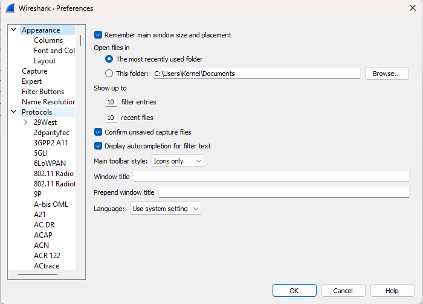

# Wireshark HTTPs Decryption

In this reposiotry there is an .zip file which consist and text file which contains keys of the pcap file which is captured along with the Wireshark network capture. There is also an sample file which consist the data for the same keys which are used to decpyt the data.

In order to do we have to add the text file into TLS drop down menu. You can find the following in
```Bash
    Edit -> Prefrence -> Protocols -> TLS
```

## Installation

After cloning the repo, unzip the file and then add the file into TLS option

```bash
  git clone https://github.com/MyFaduGame/wireshark-https.git
  cd wireshark-https
```
    
## Screenshots




## Authors

- [@MyFaduGame](https://www.github.com/myfadugame)

